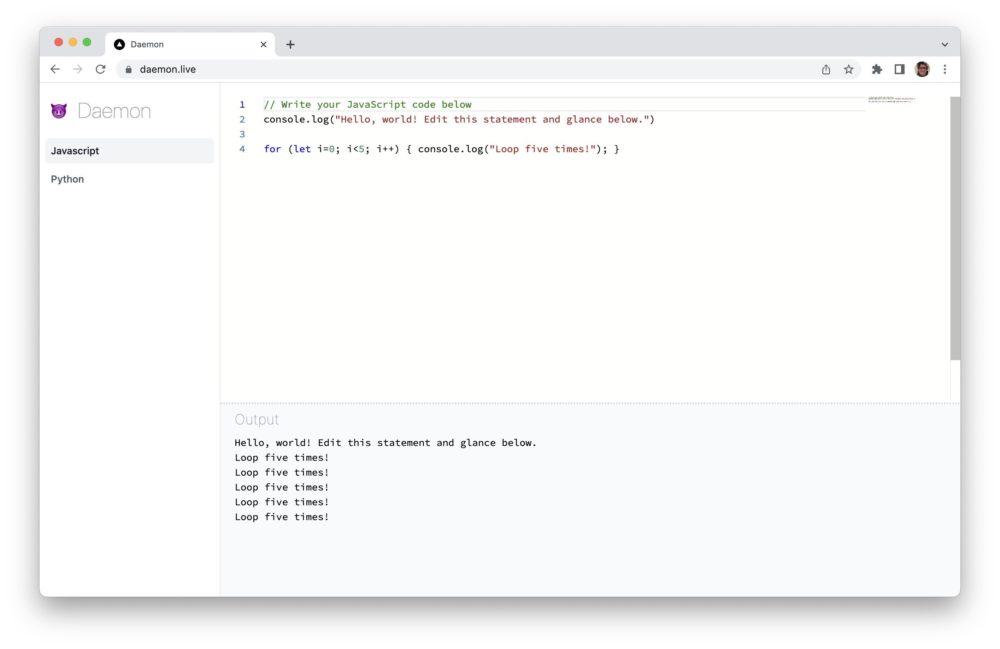

# 😈 daemon

A JavaScript and Python browser sandbox that executes your code on every keystroke.

Live at [www.daemon.live](https://www.daemon.live)

Daemon uses an ephemeral web worker to asynchronously execute your JavaScript code and push the STOUT/STERR back to a console. Since web workers run on a second thread, you won't lock your browser by typing "while(true){}", etc., which is necessary in this context because it's surprisingly common to write an infinite loop before you finish typing :) The web worker uses Pyodide, a Python runtime compiled to WASM, to execute Python inside the webworker. It uses Monaco editor from VSCode with a React wrapper.

This is inspired by wanting to share my environment habit of configuring /nodemon/ and /nodemon --exec python3 \_\_\_/, etc, to have a ongoing console printout as I write.
